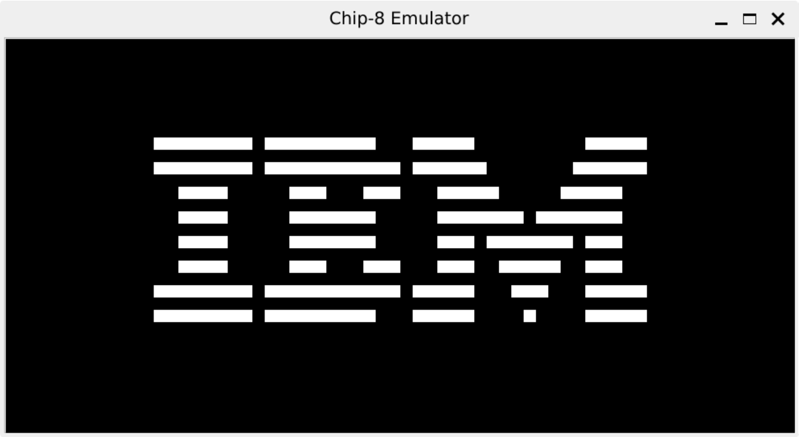

# CHIP-8 Emulator

An emulator for the CHIP-8 Chip written in Python. A small project for learning and understanding emulators.



## Running the emulator

You can run the emulator without installing the package:

```bash
source .venv/bin/activate
python -m chip8_emulator <path_to_rom>
```

## Keypad

The following table shows the mapping between the CHIP-8 keypad and the computer keyboard:

**Keyboard**

|   |   |   |   |
|---|---|---|---|
| 1 | 2 | 3 | 4 |
| Q | W | E | R |
| A | S | D | F |
| Z | X | C | V |

**Chip-8 Keypad**

|   |   |   |   |
|---|---|---|---|
| 1 | 2 | 3 | C |
| 4 | 5 | 6 | D |
| 7 | 8 | 9 | E |
| A | 0 | B | F |

## Development

The project uses [devcontainers](https://containers.dev) to generate a development environment. However, you can always setup a local environment by installing the dependencies listed in the `pyproject.toml` file, using, for example, [uv](https://docs.astral.sh/uv/).

```bash
uv sync
```

## References

- [How to write an emulator (CHIP-8 interpreter)](https://multigesture.net/articles/how-to-write-an-emulator-chip-8-interpreter/)
- [Guide to making a CHIP-8 emulator](https://tobiasvl.github.io/blog/write-a-chip-8-emulator/)
- [CHIP 8 description](https://en.wikipedia.org/wiki/CHIP-8#Virtual_machine_description)
- [CHIP-8 Test suite](https://github.com/Timendus/chip8-test-suite)
- [Awesome CHIP-8](https://github.com/tobiasvl/awesome-chip-8)
- [CHIP-8 Games](https://johnearnest.github.io/chip8Archive/)
